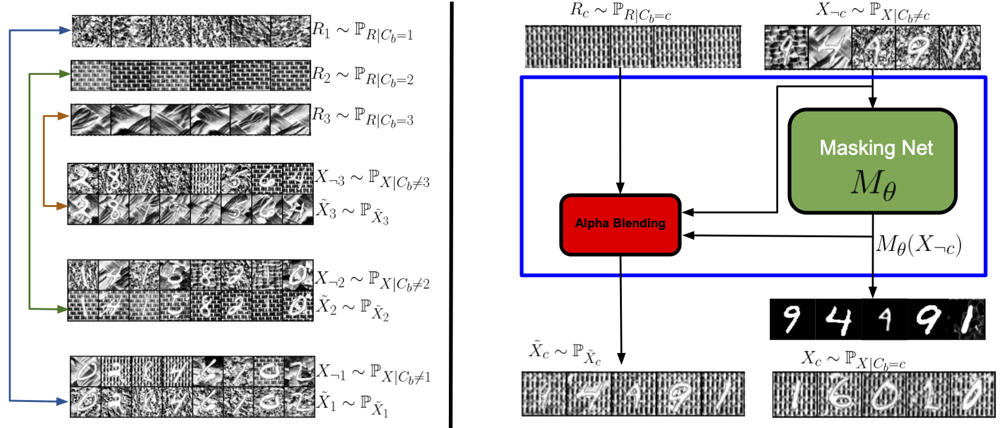

<div align="center">

# Background-Conditional Weakly Supervised Object Segmentation  
[Read the full paper](https://arxiv.org/abs/2506.22505)



</div>

<br>

## Abstract

As a computer vision task, automatic object segmentation remains challenging in specialized image domains without massive labeled data, such as synthetic aperture sonar images, remote sensing, biomedical imaging, etc. In any domain, obtaining pixel-wise segmentation masks is expensive. In this work, we propose a method for training a masking network to perform binary object segmentation using weak supervision in the form of image-wise presence or absence of an object of interest, which provides less information but may be obtained more quickly from manual or automatic labeling. A key step in our method is that the segmented objects can be placed into background-only images to create realistic images of the objects with counterfactual backgrounds. To create a contrast between the original and counterfactual background images, we propose to first cluster the background-only images, and then during learning create counterfactual images that blend objects segmented from their original source backgrounds to backgrounds chosen from a targeted cluster. One term in the training loss is the divergence between these counterfactual images and the real object images with backgrounds of the target cluster. The other term is a supervised loss for background-only images. While an adversarial critic could provide the divergence, we use sample-based divergences. We conduct experiments on side-scan and synthetic aperture sonar in which our approach succeeds compared to previous unsupervised segmentation baselines that were only tested on natural images. Furthermore, to show generality we extend our experiments to natural images, obtaining reasonable performance with our method that avoids pretrained networks, generative networks, and adversarial critics.

<br>

## Data
### [CUB-2011-200](https://www.kaggle.com/datasets/wenewone/cub2002011)
After downloading the data, set the following attributes in `configs/data/birds.yaml`: 
````
data_dir: {path to images}
mask_dir: {path to masks}
````
We depend on a text file in the root directory to split the data into training and testing. The file should be called 
`train_val_test_split.txt`. You may use the one provided by the dataset which splits the data 50/50. You should rename 
the file to match the given name though. 

### [Side Scan Sonar (SSS)](https://umfieldrobotics.github.io/ai4shipwrecks/download/)

After downloading the data, set the following attributes in `configs/data/sss.yaml`: 
````
data_dir: {path to the training and testing folders}
````

### Synthetic Dataset

This one is more involved. We have four synthetic datasets: MNIST, fashion MNIST, dSprites on Textures and dSprites on SAS.


For the first three, you need to adjust the following attribute in `configs/data/mnist.yaml`:

````
dataset_type: {MNIST,FashionMNIST, dsprites}
````

For `dsprites`, you also need to set this attribute to true in the same file:
````
unify_fg_objects_intensity: True
````

For dSprites on SAS, you need to adjust the following attributes `configs/data/sas.yaml` file:

````
background_dir: {location of SAS H5 file}
````
The SAS dataset can be downloaded from [here]( https://gergltd.com/data/sassed/sassed.h5)


## Environment  Setup
After cloning the repo, you can create a new env based on the attached requirements.txt:
> conda create --name <env> --file requirements.txt

## Running Experiments

Our training scheme is composed of two stages: 
1. Train the autoencoder/contrastive encoder to get the background clusters. 
2. Train the segmentation network using the clustering model obtained from the first step. 

Your starting point, will be `configs/experiments` where it contains the information about every experiment in the paper.
Make sure you set the attributes in the yaml file as described above. 

The command to run any experiment is this: 

```
python -m src.train experiment={experiment}
```
where `{experiment}` is the file in `configs\experiment\`, don't include the yaml file extension. 


### Background Clustering

For SSS background clustering experiment, run `sss_cl.yaml`. 

For CUB dataset, run `cl.yaml`.

For SAS + dsprites, run `sas_cl.yaml`.

For all other datasets, run `autoencoder.yaml`.

### Segmentation 
After running the background clustering, you will get in the logs, the path of where the clustering modules are saved. 
Make sure to set the `background_classifier` attributes to the desired clustering model. This attribute can be found in any data yaml file or 
it can be override in the experiment yaml files. 


For SSS segmentation, run `sss_segmentation.yaml`. 

For CUB dataset, run `cub_segmentation.yaml`.

For SAS + dsprites, run `sas_segmentation.yaml`.

For all other datasets, run `synthetic_segmentation.yaml`.


>Note: I kept the values as they were in my code just to get sense how values should look like.


## Project Structure

The directory structure of new project looks like this:

```
├── .github                   <- Github Actions workflows
│
├── configs                   <- Hydra configs
│   ├── callbacks                <- Callbacks configs
│   ├── data                     <- Data configs
│   ├── debug                    <- Debugging configs
│   ├── experiment               <- Experiment configs
│   ├── extras                   <- Extra utilities configs
│   ├── hparams_search           <- Hyperparameter search configs
│   ├── hydra                    <- Hydra configs
│   ├── local                    <- Local configs
│   ├── logger                   <- Logger configs
│   ├── model                    <- Model configs
│   ├── paths                    <- Project paths configs
│   ├── trainer                  <- Trainer configs
│   │
│   ├── eval.yaml             <- Main config for evaluation
│   └── train.yaml            <- Main config for training
│
├── data                   <- Project data
│
├── logs                   <- Logs generated by hydra and lightning loggers
│
├── notebooks              <- Jupyter notebooks. Naming convention is a number (for ordering),
│                             the creator's initials, and a short `-` delimited description,
│                             e.g. `1.0-jqp-initial-data-exploration.ipynb`.
│
├── scripts                <- Shell scripts
│
├── src                    <- Source code
│   ├── data                     <- Data scripts
│   ├── models                   <- Model scripts
│   ├── utils                    <- Utility scripts
│   │
│   ├── eval.py                  <- Run evaluation
│   └── train.py                 <- Run training
│
├── tests                  <- Tests of any kind
│
├── .env.example              <- Example of file for storing private environment variables
├── .gitignore                <- List of files ignored by git
├── .pre-commit-config.yaml   <- Configuration of pre-commit hooks for code formatting
├── .project-root             <- File for inferring the position of project root directory
├── environment.yaml          <- File for installing conda environment
├── Makefile                  <- Makefile with commands like `make train` or `make test`
├── pyproject.toml            <- Configuration options for testing and linting
├── requirements.txt          <- File for installing python dependencies
├── setup.py                  <- File for installing project as a package
└── README.md
```